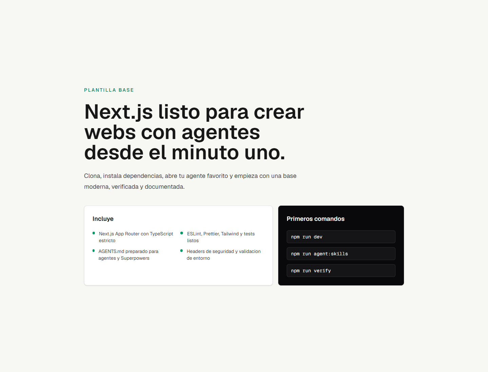

<div align="center">

# Next Agent Template ⚡️

### Production-ready Next.js 16 template engineered for collaboration with AI coding agents

A lightweight, high-performance foundation built from the ground up for developer-agent workflows (Claude Code, Cursor, Codex, OpenCode, Antigravity, Copilot, Gemini). Pre-configured with strict boundaries, modular agent instructions, instant Rust tooling, and full-stack capabilities.

[](https://nextjs.org/)
[](https://react.dev/)
[](https://www.typescriptlang.org/)
[](https://tailwindcss.com/)
[](https://better-auth.com)
[](https://prisma.io)
[](https://polar.sh)
[](https://oxc.rs)
[](https://vitest.dev/)
[](./LICENSE)

<br />

[🌐 **Live Demo**](https://next-agent-template.vercel.app) • [⚡ **Deploy on Vercel**](https://vercel.com/new/clone?repository-url=https://github.com/moisesvalero/next-agent-template) • [⭐ **Star on GitHub**](https://github.com/moisesvalero/next-agent-template)

<br />



</div>

---

## 🤖 Why This Template for AI Coding Agents?

Most starter templates are built solely for human developers, ignoring how LLMs parse codebases. This template is architected specifically to maximize the reasoning power, accuracy, and execution speed of AI coding assistants:

- **Context-Window Optimized**: No barrel files (`index.ts`) in internal modules, preventing token waste and circular dependencies. All rule files are strictly under 32 KB.
- **Hierarchical Agent Rules**: Root `AGENTS.md` establishes overarching invariants, while local domain rules (`src/lib/auth/AGENTS.md`, `src/lib/payments/AGENTS.md`, `src/lib/security/AGENTS.md`) guide agents with laser focus.
- **Sub-10ms Feedback Loop**: Powered by **Oxlint** in Rust. Agents get instant linter feedback in milliseconds instead of waiting for heavy legacy tooling.
- **Strict Quality Gates**: `pnpm run verify` and `pnpm run verify:release` provide agents with clear automated verification to self-audit their work before declaring a task complete.
- **Agent Skill Integrations**: Built-in scripts for `autoskills` and `impeccable` to install domain-specific workflows and design auditing directly in the agent workspace.
- **AEO Native (AI Engine Optimization)**: Ships with `llms.txt`, machine-readable Markdown twins, and search metadata so external AI models can discover and reason about your site.
- **Zero-Bloat Boot**: Clones and boots in seconds without forcing local databases or Docker containers. Full-stack modules (Better Auth, Prisma 7, Polar/Stripe) are completely decoupled and opt-in.

---

## Quick Start

Get up and running in less than 30 seconds:

```bash
git clone https://github.com/moisesvalero/next-agent-template.git my-saas
cd my-saas
pnpm install
pnpm run agent:skills
pnpm run dev
```

Then open `http://localhost:3000` in your browser. The app runs immediately in **zero-bloat mode** without requiring a database to preview the landing page and UI components!

---

## Tech Stack

- **Framework**: Next.js 16 (App Router + Turbopack)
- **Library & Language**: React 19 & Strict TypeScript
- **Styling**: Tailwind CSS v4
- **Linter**: Oxlint for lightning-fast static analysis (Rust)
- **Dead Code/Dependency Detector**: Knip to catch unused dependencies, exports, and files
- **Formatter**: Prettier with Tailwind CSS class sorting
- **Testing**: Vitest, jsdom, and React Testing Library
- **Git Hooks**: Husky & lint-staged to validate code before every commit
- **Validation**: Zod for strict environment variable validation
- **SaaS Auth**: Better Auth (Admin roles, user impersonation, multi-tenant organizations, TOTP 2FA)
- **Database & ORM**: Prisma ORM with PostgreSQL adapter and visual web studio
- **Monetization & Credits**: Polar (Merchant of Record) and Stripe with an atomic credit ledger
- **UI Base**: shadcn-style component baseline with `components.json`, `cn()` utility, and a `Button` component
- **Optional Integrations**: Pre-configured Supabase and Sanity clients
- **SEO/AEO/GEO**: Pre-configured metadata, sitemap, robots, manifest, dynamic Open Graph, `llms.txt` route, and JSON-LD structured data

## Working with AI Agents

1. Clone this template for any new web project.
2. Open the project directory in your preferred AI-powered editor or terminal agent.
3. Prompt your agent to read [AGENTS.md](file:///AGENTS.md) before making any code modifications.
4. Run `pnpm run agent:skills` to let `autoskills` detect your environment and install helpful agent skills.
5. Before completing any task, always ask the agent to run `pnpm run verify` or `pnpm run verify:release`.

## Scripts

```bash
pnpm run dev              # Start the local development server
pnpm run build            # Build the application for production
pnpm run start            # Start the production build locally
pnpm run lint             # Run oxlint for static analysis
pnpm run lint:fix         # Run oxlint with automatic fixes
pnpm run knip             # Find unused dependencies, exports, and files
pnpm run ui:add           # Add new shadcn UI components
pnpm run check            # Run TypeScript compiler checks without emitting files
pnpm run format           # Format codebase using Prettier
pnpm run format:check     # Check formatting compliance with Prettier
pnpm test                 # Run unit tests using Vitest
pnpm run test:watch       # Run unit tests in watch mode
pnpm run audit            # Audit dependencies for high+ vulnerability alerts
pnpm run db:generate      # Generate Prisma client types
pnpm run db:push          # Push schema changes to database
pnpm run db:migrate       # Run Prisma migrations in development
pnpm run db:studio        # Open Prisma Studio web visual database viewer
pnpm run docker:up        # Start optional local PostgreSQL container
pnpm run docker:down      # Stop local PostgreSQL container
pnpm run verify           # Run lint, knip, typecheck, formatting check, tests, build, and audit
pnpm run verify:release   # Run comprehensive release audit (agent rules size, AEO accessibility, build)
pnpm run agent:skills     # Run pnpm dlx autoskills to configure agent skills
pnpm run agent:impeccable # Install the Impeccable skill in your workspace
```

## AI Agent Tools

This template recommends two core tools to supercharge your AI agent's performance:

### AutoSkills

[AutoSkills](https://www.autoskills.sh/) is an audited command-line utility that automatically detects your project's technology stack (supporting React, Next.js, Vue, Astro, Tailwind, and over 20 other technologies) and installs the best contextual operational guidelines, custom rules, and workflow capabilities for your AI agents (such as Claude Code, Cursor, Codex, OpenCode, Antigravity, or Copilot).

Instead of pulling files directly from unverified sources, AutoSkills routes all requests through a secure, reviewed, and audited registry. Selected skill files are downloaded, verified against recorded SHA-256 integrity hashes, and written locally into your project workspace.

To initialize or update the recommended agent skills for this workspace:

```bash
pnpm run agent:skills
```

This script executes `pnpm dlx autoskills` to automatically configure your project environment so that any AI assistant instantly understands the directory structure, styling guidelines, and verification rules defined for this stack.

### Impeccable

[Impeccable](https://impeccable.style/) is a specialized AI skill that empowers agents to design, critique, polish, and audit user interfaces with superior visual judgment. It runs locally and integrates directly into your AI assistant via slash commands.

To install Impeccable in your project workspace:

```bash
pnpm run agent:impeccable
```

Once installed, reload your AI coding tool and interact with Impeccable directly from your agent's chat interface:

- `/impeccable init`: Initialize project design context (creates `DESIGN.md` and `PRODUCT.md`).
- `/impeccable polish [page]`: Refine spacing, typography, states, copy, and consistency on an existing page.
- `/impeccable critique`: Audit the UI to identify the highest-priority visual and layout issues.
- `/impeccable audit`: Perform a technical quality check for accessibility, responsiveness, and performance.
- `/impeccable live`: Open the live visual editor to point-and-click UI elements in the browser and generate variants directly into your source code.

## Directory Structure

```text
src/
  app/             # Routes, layouts, sitemap, robots, and global styles
  components/      # Reusable components, UI, and SEO layouts
  config/          # Global site configurations
  lib/             # Utilities, env validators, SEO helpers, and Supabase integration
  sanity/          # Sanity client configurations and queries
  test/            # Testing environment configuration
```

## SEO, AEO, and GEO

This template provides a robust setup optimized for traditional search engines (SEO), Answer Engine Optimization (AEO), and Generative Engine Optimization (GEO):

- `src/config/site.ts`: Houses site name, description, URL, locale, and keywords.
- `src/lib/seo.ts`: Provides a `createPageMetadata()` helper and JSON-LD schema builder.
- `src/components/seo/json-ld.tsx`: Safely injects structured data.
- `src/app/sitemap.ts`: Dynamically generates `/sitemap.xml`.
- `src/app/robots.ts`: Generates `/robots.txt`.
- `src/app/manifest.ts`: Generates `/manifest.webmanifest`.
- `src/app/opengraph-image.tsx`: Generates a dynamic default social sharing image.
- `src/app/llms.txt/route.ts`: Serves `/llms.txt` to help web crawlers and AI answer engines easily parse the website's context.

To customize it for your project, update `src/config/site.ts` and set `NEXT_PUBLIC_APP_URL`. Use the `createPageMetadata()` helper on specific pages to set custom titles, descriptions, or canonical URLs.

## UI with shadcn

Rather than installing shadcn as a closed dependency, this template leaves a clean, standard-compatible foundation:

- `components.json` tells the shadcn CLI where to put new components.
- `src/lib/utils.ts` exports the `cn()` class merger utility.
- `src/components/ui/button.tsx` is included as a starter component.
- Theme colors and tailwind variables are defined in `src/app/globals.css`.

You can add new components at any time:

```bash
pnpm dlx shadcn@latest add card input textarea form
```

## Supabase (Optional)

Supabase is pre-configured for authentication, database access, and storage. You don't need to create an account immediately to run the app.

Key Files:

- `src/lib/supabase/browser.ts`: Supabase client for client-side components.
- `src/lib/supabase/server.ts`: Supabase client for Server Components, Route Handlers, and Server Actions.
- `src/lib/services.ts`: Utility to check if Supabase is active and configured.

Environment Variables:

```env
NEXT_PUBLIC_SUPABASE_URL=
NEXT_PUBLIC_SUPABASE_ANON_KEY=
```

Usage in Client Components:

```tsx
"use client";

import { createSupabaseBrowserClient } from "@/lib/supabase/browser";

const supabase = createSupabaseBrowserClient();
```

Usage in Server Components:

```tsx
import { createSupabaseServerClient } from "@/lib/supabase/server";

const supabase = await createSupabaseServerClient();
```

## Sanity (Optional)

Sanity is prepared as a headless CMS for blogs, landing pages, portfolios, and easily editable content.

Key Files:

- `src/sanity/client.ts`: Sanity client initialization.
- `src/sanity/queries.ts`: Example GROQ query for fetching posts.
- `src/lib/services.ts`: Utility to check if Sanity is configured.

Environment Variables:

```env
NEXT_PUBLIC_SANITY_PROJECT_ID=
NEXT_PUBLIC_SANITY_DATASET=production
SANITY_API_READ_TOKEN=
```

Usage:

```ts
import { createSanityClient } from "@/sanity/client";
import { latestPostsQuery } from "@/sanity/queries";

const posts = await createSanityClient().fetch(latestPostsQuery);
```

## SaaS Architecture (Better Auth, Billing & Credits)

This template provides a production-grade, opt-in SaaS architecture that you can activate whenever your project evolves into a commercial micro-SaaS:

### Better Auth & Organizations

- **Multi-tenancy**: Teams, member roles (`owner`, `admin`, `member`), and email invitations out-of-the-box.
- **Admin & Impersonation**: Built-in support to impersonate users during customer support sessions and enforce account bans.
- **Two-Factor Authentication**: TOTP with QR codes and backup codes.
- **Server and Client Helpers**:
  - Server: `import { auth } from "@/lib/auth/server"`
  - Client: `import { authClient, signIn, signOut, useSession } from "@/lib/auth/client"`

### Database & Prisma Studio

The schema is defined in `prisma/schema.prisma` with models for `User`, `Session`, `Organization`, `CreditBalance`, `CreditTransaction`, and `AuditLog`.

- **Cloud Database (Zero-Install)**: Simply paste your PostgreSQL URL (Neon, Supabase, etc.) in `DATABASE_URL`.
- **Local Database (Docker)**: Run `pnpm run docker:up` to spin up PostgreSQL locally.
- **Visual DB Viewer**: Run `pnpm run db:studio` to open an interactive, spreadsheet-like interface in your browser to inspect or edit records with a click.

### Hybrid Billing & Credit Ledger

- **Polar.sh (Default)**: Functions as a Merchant of Record (MoR) to handle global sales tax and VAT compliance automatically.
- **Stripe**: Configurable by setting `PAYMENT_PROVIDER=stripe`.
- **Atomic Credit Ledger**: Located in `src/lib/payments/credits.ts`. Provides `addCredits` and `consumeCredits` backed by Prisma transactions to prevent race conditions or negative balances.
- **Private Dashboard**: Navigate to `/dashboard` to inspect the responsive user session, active organization, 2FA status, and credit packages.

## Environment Variables

Copy `.env.example` to `.env.local` to start defining your variables:

```bash
cp .env.example .env.local
```

The system environment contract is defined in `src/lib/env.ts`. Add any new environment variables there to ensure the app fails fast with clear errors if they are missing or malformed during build or runtime. Both Supabase and Sanity are optional; if their variables are missing, the application will still boot.

## Out-of-the-box Security

- `poweredByHeader` disabled in `next.config.ts`.
- Basic security headers: `X-Content-Type-Options`, `X-Frame-Options`, `Referrer-Policy`, and `Permissions-Policy`.
- HSTS enabled in production environments only.
- `.env*` files are strictly ignored by Git.
- `pnpm audit --audit-level high` is run as part of the verification suite.
- Dependabot configured for JavaScript dependencies and GitHub Actions.
- Git pre-commit hooks configured with lint-staged, TypeScript type-checking, and Vitest.

## Creating a Project From This Template

You can click the green **"Use this template"** button at the top of this repository on GitHub, or clone it manually:

```bash
git clone https://github.com/moisesvalero/next-agent-template.git my-saas
cd my-saas
pnpm install
pnpm run agent:skills
pnpm run verify
```

After cloning, customize the site `name`, `metadata`, home page layout, and environment variables to match your project requirements.

---

## 🌟 Support & Community

If you find this template helpful for your projects or vibe coding workflow, please consider giving it a **Star on GitHub** ⭐ — it helps more developers discover the project!

- **Found a bug?** [Open an issue](https://github.com/moisesvalero/next-agent-template/issues)
- **Have an idea?** Pull requests and feature suggestions are warmly welcomed!
- **Author:** [Moisés Valero](https://github.com/moisesvalero)

## License

Released under the [MIT License](./LICENSE). Free for commercial and personal projects without restrictions.
